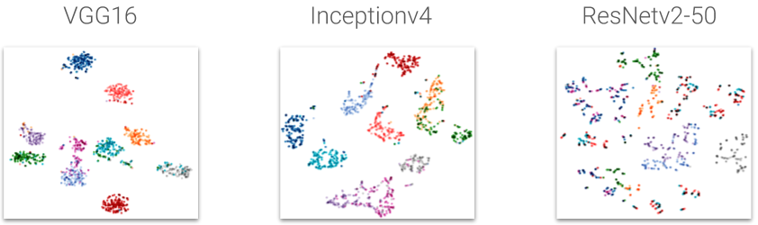

# Representation Learning for Sketches using Combined Representations

## About
In this project, a representation space is learned for sketch classification and providing suggestions of similar sketches on a subspace of the [Quick, Draw! dataset](https://github.com/googlecreativelab/quickdraw-dataset). This project utilizes both temporal and image form of sketches in a combined model.

Sample sketches of the dataset:

For this project a subspace consisting of 10 classes are used:
* 5 fruit classes:   apple, pear, blackberry, grapes, banana
* 5 vehicle classes: bus, van, truck, airplane, helicopter

For instructions on how to use this code, please see this [README](/src/README.md).

## Models 
Different models using both temporal and image data of sketches are used:

.

A final model uses both input representations(image+temporal) to create an embedding/representation for image classification and making suggestions:

## Image Models: Triplet Networks
Triplet networks in combination with the convolutional networks VGG-16, Inceptionv4 and ResNet-v2 are used to generate a representation space.

### Loss function
A softmax based version is used to calculate the triplet loss function

### Results
ResNet-v2 performs better in matching samples of the same class closer together:

But fails to generalize well as seen in classifcation accuracy and tSNE embedding:

### Modifications
To achieve better generalization the following modifications were made

#### Sampling: Semihard Triplets
Instead of sampling triplets randomly, only semi-hard triplets are chosen:

#### Loss function: Hinge-Loss

### Results after Modification
Classification accuracy: 

t-SNE visualization:

### Triplet Network vs Direct Training

## Results 
As a temporal model an LSTM with two stacked cells are used. The convolutional model is either trained end-to-end (together with the temporal) model or transferred after training the triplet network.

### Classification

### Suggestions
Neighbors are of the same class, but more often stilistically different(red) than of the same style(green)s: 

### KNN classification

